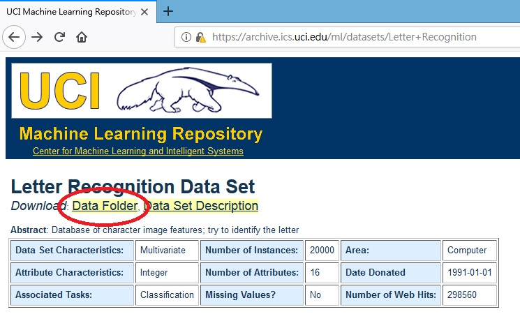

# sklearn_decision_tree #  
自己最近有在學習一些機器學習的東西  
想要試著使用sklearn套件建立決策樹  
內容主要是演示如何建立出[字母辨識](https://archive.ics.uci.edu/ml/datasets/Letter+Recognition)這個資料集的決策樹  
  
## 介紹決策樹 ##  
決策樹是一種監督式機器學習模型  
適用於分類和回歸的預測  
主要的目的是建立出一個樹狀架構的模型讓資料依照決策樹的路徑來分類  
  
## 開發環境及套件版本 ##  
我使用NotePad++編寫python  
使用到的套件包含
* python 3.6.5
* numpy 1.15.3
* matplotlib 2.2.2
* scikit-learn 0.20.0
* pydotplus 2.0.2
* xlsxwriter 1.1.2
* [graphviz 0.10.1](https://www.graphviz.org/download/) **(安裝完後需要設定環境變數)**  
  
## 流程講解 ##  
### 1. 尋找並下載資料集 ###  
尋找目標資料集並進入其文件夾  
  
   
下載資料集  
  
   
如果想要找其他的資料集可以參考 [UCI Machine Learning Repository: Data Sets](https://archive.ics.uci.edu/ml/datasets.html)  
   
### 2. 讀取資料集 ###  
利用逗號區隔出每個欄位的內容  
使用 string 當作內容的型態  
   
``` python
original_dataset = np.loadtxt('./Desktop/sklearn_decision_tree/letter-recognition.data', dtype = 'str', delimiter  = ',')
```  
   
### 3. 區分出屬性(feature attribute)和類別(class attribute) ###  
第一欄是類別其餘的都是屬性  
並將屬性的型態改成float  
   
``` python
feature_attribute = original_dataset[:, 1::].astype('float')
class_attribute = original_dataset[:, 0]
```  
   
### 4. 將資料集切割為訓練資料(training dataset)以及測試資料(test dataset) ###  
依照比例隨機區分出兩個區塊  
70% 為訓練資料集  
30% 為測試資料集  
   
``` python
feature_attributes_for_training, feature_attributes_for_test, class_attribute_for_training, class_attribute_for_test = train_test_split(feature_attribute, class_attribute, test_size = 0.3)
```  
   
### 5. 對資料集進行預處理 ###  
針對訓練資料集的每一個欄位數值計算平均數與標準差
並且記錄每個欄位的平均數與標準差  
接著會對訓練資料集進行標準化的動作  
這個步驟的主要目的是希望讓欄位之間的資料落在相同的尺度範圍內  
  
**因為訓練資料集與測試資料集都是來自於同一個母體
所以可以假設兩著的分布情形是相同的
便可以將先前訓練資料集所計算出來的平均數與標準差對測試資料集進行標準化的動作**  
  
``` python
scale = preprocessing.StandardScaler()
   
scale.fit(feature_attributes_for_training)
   
standardized_feature_attributes_for_training = scale.transform(feature_attributes_for_training)
   
standardized_feature_attributes_for_test = scale.transform(feature_attributes_for_test)
```  
   
### 6. 訓練決策樹 ###  
依照不同的深度來訓練決策樹
並且分別記錄訓練和測試的預測正確率  

``` python
depth_list = range(2, 31)

accuracy_list_of_training = []

accuracy_list_of_test = []

for depth in depth_list:
    decision_tree_classifier = DecisionTreeClassifier(max_depth = depth)

    decision_tree = decision_tree_classifier.fit(standardized_feature_attributes_for_training, class_attribute_for_training)

    prediction_list_of_training_dataset = decision_tree.predict(standardized_feature_attributes_for_training)

    accuracy_of_predict_training_dataset = metrics.accuracy_score(class_attribute_for_training, prediction_list_of_training_dataset)
    
    accuracy_list_of_training.append(accuracy_of_predict_training_dataset)

    prediction_list_of_test_dataset = decision_tree.predict(standardized_feature_attributes_for_test)

    accuracy_of_predict_test_dataset = metrics.accuracy_score(class_attribute_for_test, prediction_list_of_test_dataset)

    accuracy_list_of_test.append(accuracy_of_predict_test_dataset)
```  
  
### 7. 繪製折線圖 ###  
依據預測正確率分別繪製出訓練和測試的摺線圖  


``` python
plt.figure()

plt.plot(depth_list, accuracy_of_decision_tree_training_list, marker = 'o', label = 'training')

plt.plot(depth_list, accuracy_of_decision_tree_test_list, marker = 'o', label = 'test')

plt.title('Decision Tree')

plt.xlabel('the depth of decision tree')

plt.ylabel('accuracy')

plt.xticks(np.arange(2, 31, step = 2))

plt.yticks(np.arange(0.1, 1.2, step = 0.1))

plt.legend(loc = 'best')

#plt.savefig('./Desktop/sklearn_decision_tree/DecisionTree.png')
```  
  
### 8. 繪製最佳深度的決策樹 ###  
  
### 9. 輸出預測的結果 ###  
  
## 結論 ##  
  

