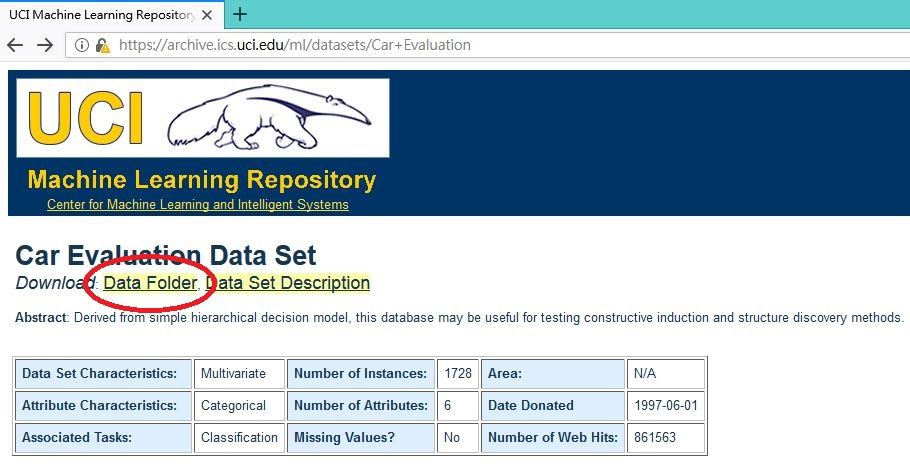
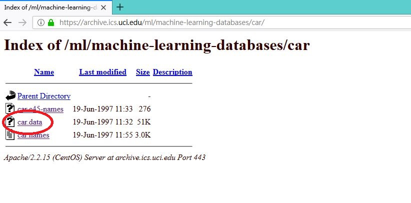

# sklearn_decision_tree #  
自己最近有在學習一些機器學習的東西  
想要試著使用sklearn套件建立決策樹  
內容主要是演示如何建立出[汽車評估](https://archive.ics.uci.edu/ml/datasets/Car+Evaluation)這個資料集的決策樹  
  
## 介紹決策樹 ##  
決策樹是一種監督式機器學習模型  
適用於分類和回歸的預測  
主要的目的是建立出一個樹狀架構的模型讓資料依照決策樹的路徑來分類  
  
## 開發環境及套件版本 ##  
我使用NotePad++編寫python  
使用到的套件包含
* python 3.6.5
* numpy 1.15.3
* matplotlib 2.2.2
* scikit-learn 0.20.0
* pydotplus 2.0.2
* xlsxwriter 1.1.2
* [graphviz 0.10.1](https://www.graphviz.org/download/) **(安裝完後需要設定環境變數)**  
  
## 流程講解 ##  
### 1. 尋找並下載資料集 ###  
尋找目標資料集並進入其文件夾  
  
   
下載資料集  
  
   
如果想要找其他的資料集可以參考 [UCI Machine Learning Repository: Data Sets](https://archive.ics.uci.edu/ml/datasets.html)  
   
### 2. 讀取資料集 ###  
利用逗號區隔出每個欄位的內容  
使用 string 當作內容的型態  
   
``` python
original_dataset = np.loadtxt('./Desktop/sklearn_decision_tree-master/car.data', dtype = 'str', delimiter  = ',')
```
   
### 3. 區分出屬性(feature attribute)和類別(class attribute) ###  
第一欄到第六欄是屬性  
- buying (售價)
   - vhigh (很高)
   - high (高)
   - med (中)
   - low (低)
- maint (保養費用)
   - vhigh (很高)
   - high (高)
   - med (中)
   - low (低)
- doors (車門數量)
   - 2 (2個)
   - 3 (3個)
   - 4 (4個)
   - 5more (5個或更多)
- persons (限乘人數)
   - 2 (2人)
   - 4 (4人)
   - more (很多人)
- lug_boot (後車箱的大小)
   - small (小)
   - med (中)
   - big (大)
- safety (安全性)
   - low (低)
   - med (中)
   - high (高)
  
最後一個欄位是類別是類別  
- class (評價)
   - unacc (不被接受的)
   - acc (可接受的)
   - good (好的)
   - vgood (很好的)

``` python
feature_attributes = original_dataset[:, 0:6]

class_attribute = original_dataset[:, 6]
```

### 4. 對資料集進行預處理 ###
屬性欄位的資料內容是屬於有順序性的離散資料  
因此我將它們轉換為數值  
  
``` python
feature_attributes = OrdinalEncoder().fit_transform(feature_attributes)

feature_attributes = feature_attributes.values
```
  
轉換的方式並不是使用 [One-Hot Encoding](https://machinelearningmastery.com/why-one-hot-encode-data-in-machine-learning/)  
原因有以下幾點  
1. 原始資料是有順序性的  
   假如使用 One-Hot Encoding 將導致轉換後的資料失去原先的特性  
   也就是說特徵之間的距離會消失
   
2. 決策樹並不適合使用 One-Hot Encoding  
   使用 One-Hot Encoding 會造成決策樹產生過多的屬性  
   可能會發生[維度的詛咒(curse of dimensionality)](https://en.wikipedia.org/wiki/Curse_of_dimensionality)

### 5. 將資料集切割為訓練資料(training dataset)以及測試資料(test dataset) ###  
依照比例隨機區分出兩個區塊  
70% 為訓練資料集  
30% 為測試資料集  
   
``` python
feature_attributes_of_training_data, feature_attributes_of_test_data, class_attribute_of_training_data, class_attribute_of_test_data = train_test_split(feature_attributes, class_attribute, test_size = 0.3)
```
  
### 6. 訓練決策樹 ###  
接著就可以開始訓練決策樹
並且分別顯示訓練和測試的預測正確率  

``` python
decision_tree_classifier = DecisionTreeClassifier()

decision_tree = decision_tree_classifier.fit(feature_attributes_of_training_data, class_attribute_of_training_data)

prediction_of_training_data = decision_tree.predict(feature_attributes_of_training_data)
accuracy_of_training_data = metrics.accuracy_score(class_attribute_of_training_data, prediction_of_training_data)
print('訓練的正確率: ' + str(accuracy_of_training_data))

prediction_of_test_data = decision_tree.predict(feature_attributes_of_test_data)
accuracy_of_test_data = metrics.accuracy_score(class_attribute_of_test_data, prediction_of_test_data)
print('測試的正確率: ' + str(accuracy_of_test_data))
```
  
### 7. 繪製決策樹 ###  
依照訓練完的結果繪製出決策樹  
並且保存為 pdf 檔案  
  
``` python
feature_name = np.array([['buying'], ['maint'], ['doors'], ['persons'], ['lug_boot'], ['safety']])
class_name = np.array(['acc', 'good', 'unacc', 'vgood'])

dot_data = tree.export_graphviz(decision_tree, feature_names = feature_name, class_names = class_name, filled = True)

graph = pydotplus.graph_from_dot_data(dot_data)

try:
    graph.write_pdf('./Desktop/sklearn_decision_tree-master/decision_tree.pdf')
except:
    print('無法繪製新的決策樹\n請先關閉已經開啟的檔案\n並重新執行程式')
```
  
### 8. 輸出預測結果 ###  
紀錄測試資料集的預測結果  
並且保存為 excel 檔案  
  
``` python
workbook = xlsxwriter.Workbook('./Desktop/sklearn_decision_tree-master/predict.xlsx')

worksheet1 = workbook.add_worksheet('Car Evaluation')

title = np.array([['原始類別', 'buying\n\n1 = vhigh\n\n2 = high\n\n3 = med\n\n4 = low', 'maint\n\n1 = vhigh\n\n2 = high\n\n3 = med\n\n4 = low', 'doors\n\n2 = 1\n\n3 = 2\n\n4 = 3\n\n5more = 4', 'persons\n\n2 = 1\n\n4 = 2\n\nmore = 3', 'lug_boot\n\nsmall = 1\n\nmed = 2\n\nbig = 3', 'safety\n\nlow = 1\n\nmed = 2\n\nhigh = 3', '', '預測類別']])
column_1 = class_attribute_of_test_data.reshape((-1, 1))
column_3 = np.full((column_1.shape[0], 1), '→')
column_4 = prediction_of_test_data.reshape((-1, 1))

result = np.concatenate((column_1, feature_attributes_of_test_data, column_3, column_4), axis = 1)
result = np.concatenate((title, result), axis = 0)

for row, data in enumerate(result):
    worksheet1.write_row(row, 0, data)

try:
    workbook.close()
except:
    print('無法輸出新的預測結果\n請先關閉已經開啟的檔案\n並重新執行程式')
```
  
## 尋找更好的決策樹 ##  
上面的決策樹是利用預設值建立出來的  
或許可以嘗試調整參數來找出最好的決策樹  

有哪些是可以調整的?
1. 控制決策樹的深度  
   如果訓練過度的話可能會發生 [overfitting](https://en.wikipedia.org/wiki/Overfitting) 的狀況  
   
2. 調整驗證測試正確率的方法  
   可以使用 [k-fold 交叉驗證](https://randomforests.wordpress.com/2014/02/02/basics-of-k-fold-cross-validation-and-gridsearchcv-in-scikit-learn/)  
   利用 k-fold 交叉驗證會更加客觀  
   並且避免過於依賴特定的訓練資料而產生偏差
   
3. 採用不同的決策樹分割演算法  
   分別使用 Entropy 和 GINI  
     
   
     
   
   兩種算法的講解可以參考[Decision tree learning](https://en.wikipedia.org/wiki/Decision_tree_learning#Gini_impurity)  
  
## 結論 ##  
依照上一個項目所說明的方向去尋找更好的決策樹  
輸出的圖片如下  


